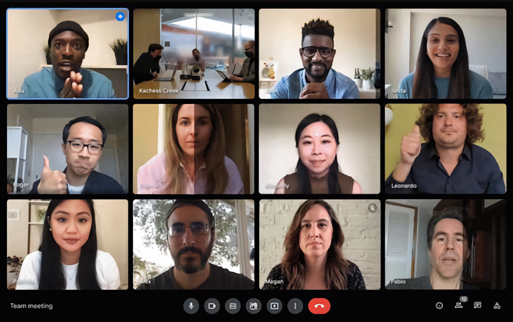
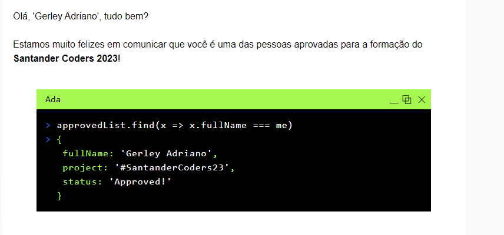

# Santander Coders - Coding-tank

<p align="center">
  
</p>

Depois de tantas etapas exaustivas, finalmente chegamos ao Coding-tank. Nessa etapa, você terá a oportunidade de interagir com a primeira parte da trilha escolhida, além de ter a oportunidade de conhecer melhor a comunidade de futuros profissionais de tecnologia que estão participando do programa.

## Sumário

- [Como funciona?](#como-funciona)
- [Como me garantir nessa fase?](#como-me-garantir-nessa-fase)
- [Dica de ouro](#dica-de-ouro)
- [Sobre a aprovação](#sobre-a-aprovação)
- [Como contribuir](#como-contribuir)
- [Licença](#licença)

## Como funciona?

Será uma semana inteira de imersão em conteúdos de programação, com aulas ao vivo, desafios e muito networking. Em vários momentos você terá a oportunidade de interagir com os outros participantes do programa, além de poder tirar dúvidas com os professores e mentores.

No último dia do Coding-tank, será o momento de você participar de uma prova avaliativa, que será composta por questões de múltipla escolha e abertas. Cada trilha terá uma prova específica, com questões relacionadas ao conteúdo que foi passado durante a semana.

## Como me garantir nessa fase?

Assuma uma postura ativa ao longo da semana. Seja curioso, tire dúvidas, participe dos desafios e interaja com os outros participantes. Sempre deixe sua câmera ligada. Compartilhe suas experiências de forma que maximize o aprendizado de todos. 

A prova, em nível de dificuldade e conteúdo, será bem condizente com os conteúdos vistos durante a semana. Por isso, se sua prova exigir a demonstração de habilidades em programação, por exemplo, evite usar abordagens que não foram vistas durante a semana. Lembre-se que seu código será avaliado por outros professores e mentores, que não necessariamente estarão familiarizados com a abordagem que você escolheu.

## Dica de ouro

Nesse momento, todos estão bem perto da aprovação. Não deixe de fazer bons networks, pois eles serão muito importantes para sua carreira. A princípio, proponha resolução de exercícios em conjunto. Isso vai te ajudar a conhecer melhor os outros participantes e a se preparar para a prova.

Durante a prova, caso envolva programação, detalhe bem o seu raciocínio. Seja com comentários ou até mesmo com o nome das variáveis e funções bem claros. Isso vai ajudar os professores e mentores a entenderem o que você está fazendo e, consequentemente, a te dar mais pontos.

## Sobre a aprovação

No dia especificado no cronograma, você receberá um e-mail com o resultado da sua prova. Caso você tenha sido aprovado, parabéns! É um momento que vale a pena comemorar. Um processo seletivo tão concorrido como esse, não é para qualquer um.

<p align="center">
  
</p>

Além da mensagem de aprovação, você receberá todas as instruções para o começo das aulas. Um novo email com um contrato de aceite será enviado para você. Leia com atenção e assine o contrato. Caso você não assine o contrato, você não poderá participar da sua trilha.

## Como contribuir

Caso você tenha participado de uma dinâmica e queira contribuir com esse repositório, basta criar um pull request com as suas dicas. Se você não sabe como fazer isso, basta seguir os seguintes passos:

```bash
# Clone o repositório
git clone

# Crie uma branch para fazer suas alterações
git checkout -b feature/sua-feature

# Faça o commit das suas alterações
git commit -m 'feat: Minha nova feature'

# Faça o push das suas alterações para o repositório remoto
git push origin feature/sua-feature
```

Depois que o seu pull request for aceito, você pode deletar a sua branch.

## Licença

Esse repositório está sob a licença MIT. Veja o arquivo [LICENSE](LICENSE) para mais detalhes.